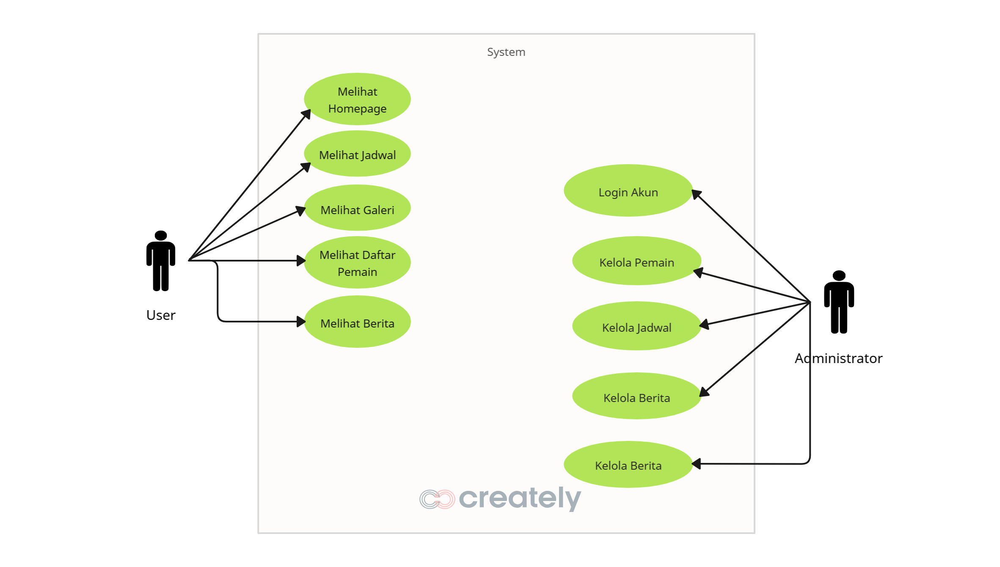

# Garuda Hustler - Website Basket SMK Negeri 1 Garut

Website resmi tim basket **Garuda Hustler** dari SMK Negeri 1 Garut. Platform untuk menampilkan informasi tim, jadwal pertandingan, galeri foto, berita, dan manajemen konten melalui admin panel.

## 🎯 Tentang Proyek

Aplikasi ini dibuat sebagai bagian dari **Ujian Kompetensi Keahlian (UKK)** untuk mendigitalkan manajemen tim basket SMK Negeri 1 Garut. Memudahkan admin dalam mengelola data tim, pemain, jadwal pertandingan, dan publikasi berita.

## ✨ Fitur Utama

### Frontend

-   🏠 Homepage dengan statistik tim
-   👥 Halaman informasi tim & roster pemain
-   📅 Jadwal pertandingan dengan hasil dan score
-   📷 Galeri foto responsive
-   📰 Berita & artikel terbaru
-   🔐 Login untuk akses admin

### Admin Panel

-   📊 Dashboard dengan overview data
-   👤 Manajemen pemain (tambah, edit, hapus)
-   🎮 Manajemen pertandingan
-   🖼️ Upload dan kelola galeri
-   📝 Buat dan publikasi berita
-   📱 Fully responsive di mobile

## 🛠️ Teknologi

| Layer    | Technology                   |
| -------- | ---------------------------- |
| Backend  | Laravel 12, PHP 8.2+, MySQL  |
| Frontend | Tailwind CSS, Blade Template |
| Tools    | Vite, Composer, NPM          |
| Database | MySQL 5.7+                   |

## 📊 Database Schema (ERD)


### Tabel Utama

-   **users** - Admin dan member accounts
-   **teams** - Informasi tim basket
-   **players** - Daftar pemain
-   **games** - Jadwal dan hasil pertandingan
-   **galleries** - Koleksi foto
-   **news** - Artikel dan berita
-   **events** - Event/kegiatan tim

## 👤 Use Case Diagram



## 🚀 Instalasi

### Requirements

```bash
- PHP 8.2+
- MySQL 5.7+
- Composer
- Node.js & npm
```

### Setup

1. **Clone & install dependencies**

    ```bash
    git clone <repo-url>
    cd garuda-smkn-ukk
    composer install
    npm install
    ```

2. **Environment setup**

    ```bash
    cp .env.example .env
    php artisan key:generate
    ```

3. **Database config**

    ```bash
    # Edit .env
    DB_DATABASE=dbgarudahustler
    DB_USERNAME=root
    DB_PASSWORD=

    # Jalankan migration & seed
    php artisan migrate:fresh --seed
    ```

4. **Build & run**
    ```bash
    npm run build
    php artisan serve
    ```

Buka `http://localhost:8000`

## 🔑 Default Account

| Role   | Email             | Password |
| ------ | ----------------- | -------- |
| Admin  | admin@garuda.test | password |
| Member | user@example.com  | password |

## 📍 Routes

### Frontend

-   `/` - Homepage
-   `/team` - Informasi Tim
-   `/schedule` - Jadwal Pertandingan
-   `/gallery` - Galeri Foto
-   `/news` - Berita
-   `/login` - Login

### Admin Panel

-   `/admin` - Dashboard
-   `/admin/players` - Manajemen Pemain
-   `/admin/matches` - Manajemen Pertandingan
-   `/admin/gallery` - Manajemen Galeri
-   `/admin/news` - Manajemen Berita

## 🔒 Keamanan

-   ✅ CSRF Protection
-   ✅ Password Hashing (bcrypt)
-   ✅ Role-Based Access Control
-   ✅ SQL Injection Prevention (Eloquent ORM)
-   ✅ XSS Protection (Blade escaping)
-   ✅ Input Validation

## 📱 Responsive

Website responsive di semua ukuran layar:

-   📱 Mobile: 320px - 767px
-   💻 Tablet: 768px - 1024px
-   🖥️ Desktop: 1920px+

## 📝 Features Terbaru

### v1.1.0 - Mobile & Form Improvements

-   Admin panel fully responsive dengan hamburger menu
-   Input pertandingan dipisah (date & time) lebih simple
-   Tombol navigasi kembali ke website
-   Smooth sidebar overlay untuk mobile

## 👨‍💻 Pengembang

Dikembangkan untuk **UKK SMK Negeri 1 Garut**  
**Status:** ✅ Production Ready

## 📄 Lisensi

MIT License - Bebas untuk penggunaan edukatif

---

**Garuda Hustler Basketball Team** 🏀  
_SMK Negeri 1 Garut_
